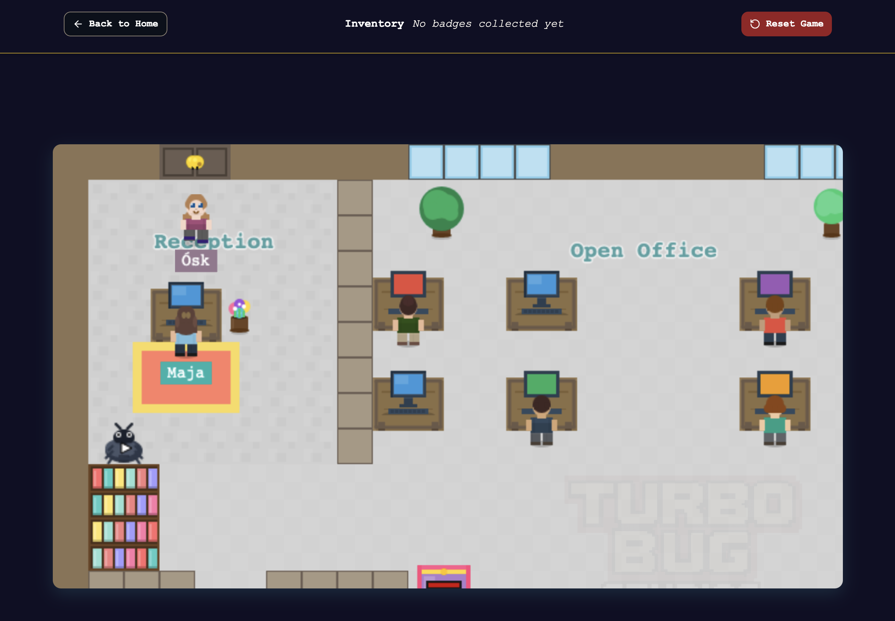

# 🎮 Ósk’s Office Adventure Game

*A tiny pixel adventure about ambition, curiosity, and a frontend developer who turned her job application into a game.*
 

  

## 🌟 About the Project

I’m **Ósk,** a frontend developer who, while applying for a position at a game studio, got *a little bit* carried away.

Instead of sending a traditional cover letter, I decided to **make my cover letter into a 2D pixel game**. Since I’d never created a game before, I teamed up with [**Lovable.dev**](https://lovable.dev/) and their AI tools to see how far I could push my creativity (and patience).

The goal was simple:

- 🕹️ Create a working 2D game from scratch as a frontend dev
- 💡 Learn something new
- 🎨 Build something fun
- 🤖 See if AI can *actually* help with a real creative project and lay the groundwork

Spoiler: It did!

 

## 🕹️ The Game

You play as **Ósk**, who’s on her way to a company she dreams of joining. Explore the office, meet employees, go through a lighthearted “interview,” and discover who Ósk is, and what she has to offer.

It’s not a serious game but a *fun*, slightly silly, and personal interactive story meant to show a bit of my personality, creativity, and love for learning new things.

 

## 💻 Play the Game

👉 **[Play here!](https://osks-office-adventure-game.lovable.app)**

🖥️ Best experienced on desktop browsers

 

## 🧠 Technologies Used

This project was built with a mix of frontend web magic and pixel art charm:

- ⚛️ **Framework:** [React](https://react.dev/) + TypeScript
- 🎮 **Game Logic / Rendering:** [Phaser](https://phaser.io/)
- 💅 **Styling:** [Tailwind CSS](https://tailwindcss.com/)
- 🧑‍🎨 **Graphics:** Custom pixel art made with ❤️
- 🤖 **AI Assistance:** [Lovable.dev](https://lovable.dev/)

 

## 💌 Final Thoughts

Thanks for checking out **Ósk’s Office Adventure**!

If you’re reading this as part of my job application, I hope you enjoy playing it as much as I enjoyed making it.

This is my first-ever game, and honestly, I had so much fun doing it! 

> “Sometimes the best way to apply for a job… is to make it a quest.” 🗺️
